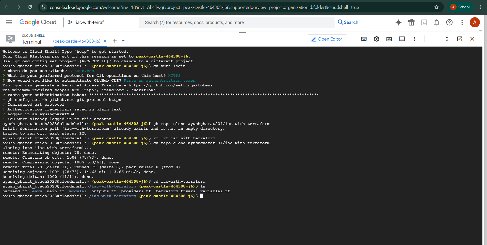
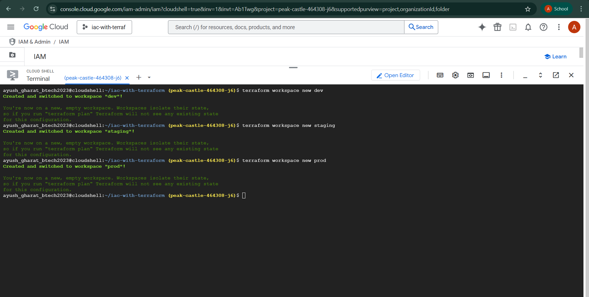
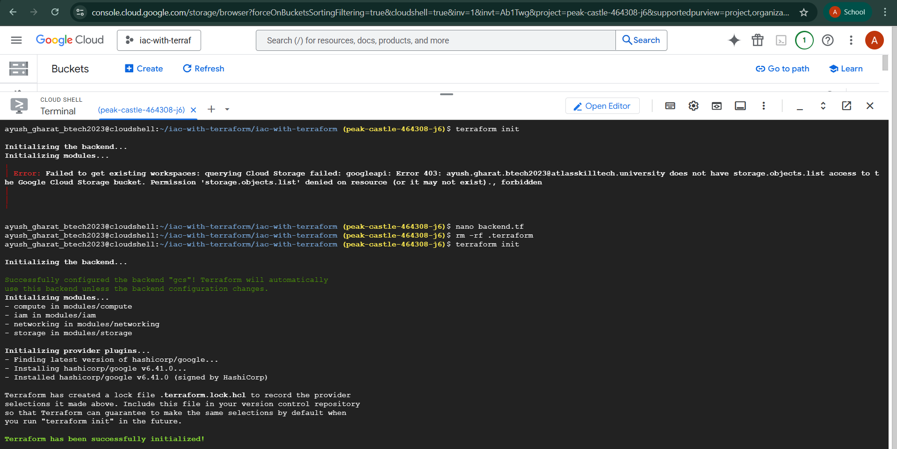
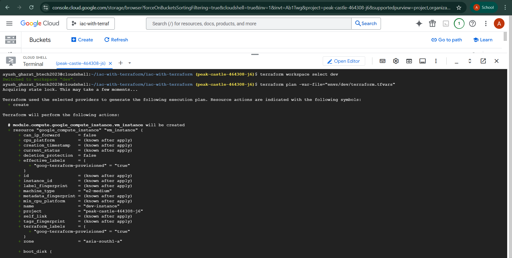
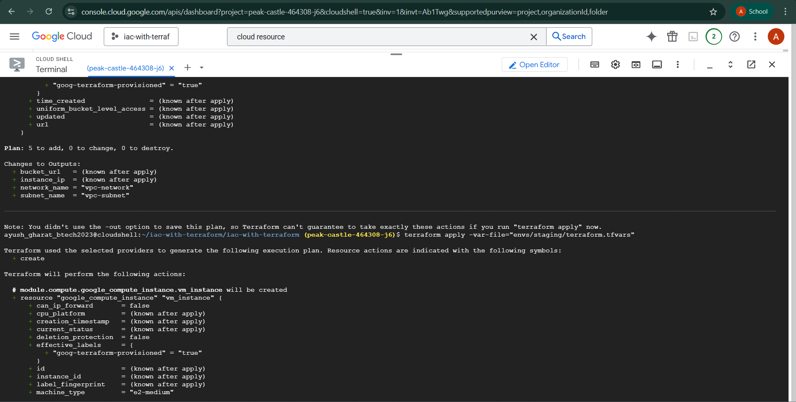
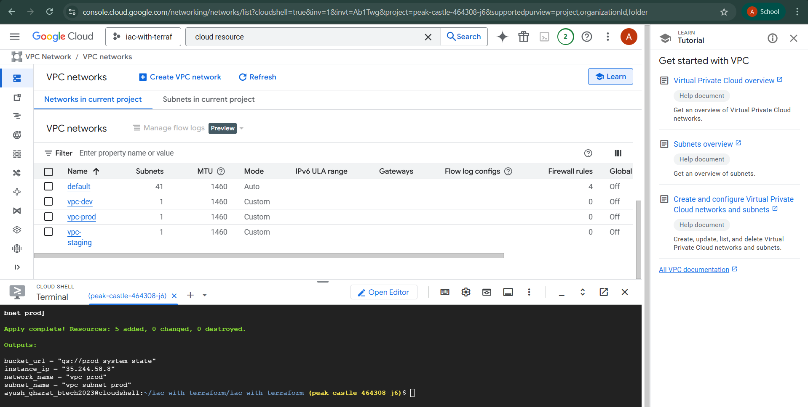
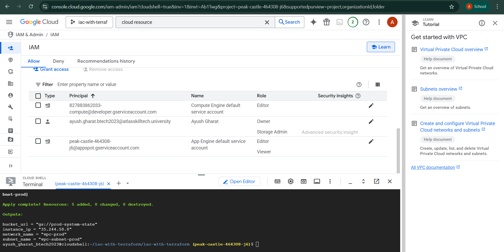
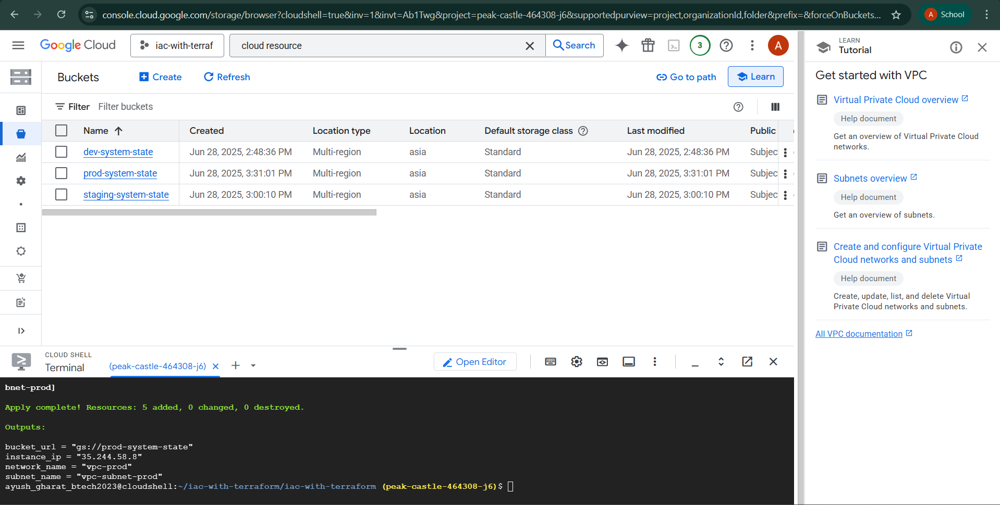
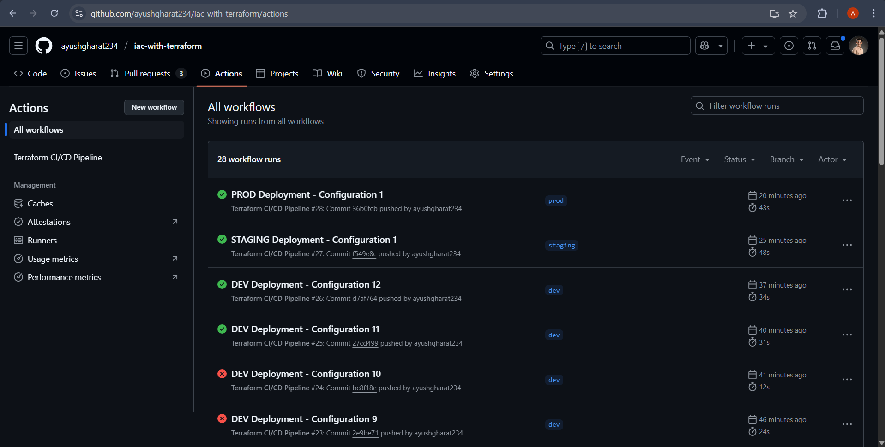
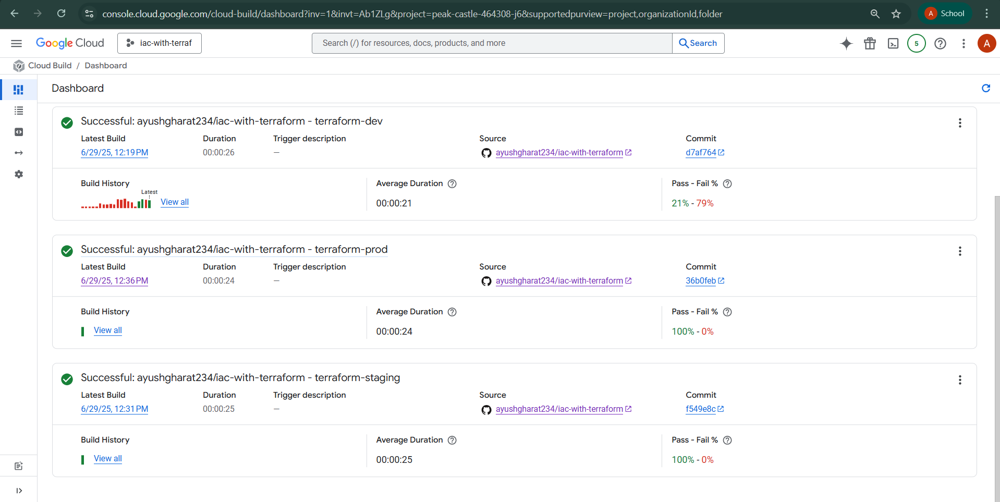

# Infrastructure as Code with Terraform on Google Cloud Platform

[](https://www.terraform.io/)
[](https://cloud.google.com/)
[](https://cloud.google.com/build)

A comprehensive Infrastructure as Code (IaC) project demonstrating multi-environment deployment on Google Cloud Platform using Terraform. This project showcases best practices for managing cloud infrastructure across development, staging, and production environments.

## 🏗️ Architecture Overview

This project implements a modular Terraform infrastructure with the following components:

- **Networking**: VPC and subnets for network isolation
- **Compute**: Virtual machine instances for application hosting
- **Storage**: Google Cloud Storage buckets for data persistence
- **IAM**: Identity and Access Management for secure resource access
- **CI/CD**: Cloud Build integration for automated deployments

### Infrastructure Architecture Diagram


*Detailed architecture diagram showing the complete infrastructure setup across all environments*

### Infrastructure Components

```
┌─────────────────────────────────────────────────────────────┐
│                    Google Cloud Platform                    │
├─────────────────────────────────────────────────────────────┤
│  ┌─────────────┐  ┌─────────────┐  ┌─────────────┐          │
│  │   Dev Env   │  │ Staging Env │  │  Prod Env   │          │
│  └─────────────┘  └─────────────┘  └─────────────┘          │
├─────────────────────────────────────────────────────────────┤
│  ┌─────────────┐  ┌─────────────┐  ┌─────────────┐          │
│  │   VPC       │  │   Compute   │  │   Storage   │          │
│  │ Subnets     │  │   Instances │  │   Buckets   │          │
│  └─────────────┘  └─────────────┘  └─────────────┘          │
├─────────────────────────────────────────────────────────────┤
│  ┌─────────────┐  ┌─────────────┐  ┌─────────────┐          │
│  │     IAM     │  │ Cloud Build │  │ Terraform   │          │
│  │   Roles     │  │   Pipeline  │  │  Backend    │          │
│  └─────────────┘  └─────────────┘  └─────────────┘          │
└─────────────────────────────────────────────────────────────┘
```

## 🌿 Branch Strategy

This repository uses a multi-branch strategy for environment-specific deployments:

### **Main Branch** (Current)
- **Purpose**: Project documentation and showcase
- **Contents**: README, architecture diagrams, screenshots
- **Use Case**: Project overview and documentation

### **Environment Branches**
- **`dev`** → Development environment infrastructure
- **`staging`** → Staging environment infrastructure  
- **`prod`** → Production environment infrastructure

## 📁 Project Structure

```
iac-with-terraform-gcp/
├── 📁 architecture/              # Architecture diagrams and documentation
├── 📁 screenshots/               # Project documentation screenshots
├── README.md                    # Project documentation (this file)
└── 📁 [Environment Branches]     # Infrastructure code per environment
    ├── 📁 modules/               # Reusable Terraform modules
    │   ├── 📁 networking/        # VPC and subnet configuration
    │   ├── 📁 compute/           # VM instance management
    │   ├── 📁 storage/           # GCS bucket configuration
    │   └── 📁 iam/               # IAM roles and permissions
    ├── 📁 envs/                  # Environment-specific configurations
    │   ├── 📁 dev/               # Development environment
    │   ├── 📁 staging/           # Staging environment
    │   └── 📁 prod/              # Production environment
    ├── main.tf                   # Main Terraform configuration
    ├── variables.tf              # Variable definitions
    ├── outputs.tf                # Output definitions
    ├── providers.tf              # Provider configuration
    ├── backend.tf                # Backend configuration
    ├── cloudbuild.yaml          # CI/CD pipeline configuration
    └── terraform.tfvars          # Default variable values
```

## 🚀 Getting Started

### Choose Your Environment

To work with the actual infrastructure code, switch to the appropriate environment branch:

```bash
# For Development Environment
git checkout dev

# For Staging Environment  
git checkout staging

# For Production Environment
git checkout prod
```

### Quick Start Guide

1. **Clone the repository**:
   ```bash
   git clone <your-repository-url>
   cd iac-with-terraform-gcp
   ```

2. **Switch to your target environment**:
   ```bash
   git checkout dev    # or staging, or prod
   ```

3. **Follow the environment-specific README** in each branch for detailed setup instructions.

## 🛠️ Prerequisites

Before you begin, ensure you have the following installed:

- [Terraform](https://www.terraform.io/downloads.html) (>= 1.8.0)
- [Google Cloud SDK](https://cloud.google.com/sdk/docs/install)
- [Git](https://git-scm.com/downloads)

### Required Permissions

Your Google Cloud account needs the following roles:
- Project Owner or Editor
- Cloud Build Service Account
- Storage Admin (for backend configuration)

## 📚 Code Architecture

### Modular Design

The infrastructure is organized into reusable modules:

#### **Networking Module**
```hcl
resource "google_compute_network" "vpc" {
  name                    = "vpc-${var.environment}"
  auto_create_subnetworks = false
}

resource "google_compute_subnetwork" "subnet" {
  name = "vpc-subnet-${var.environment}"
  ip_cidr_range = "10.10.0.0/24"
  region = var.region
  network = google_compute_network.vpc.id
}
```

#### **Compute Module**
```hcl
resource "google_compute_instance" "vm_instance" {
    name = var.instance_name
    machine_type = "e2-medium"
    zone = var.zone

    boot_disk {
      initialize_params {
        image = "debian-cloud/debian-12"
      }
    }

    network_interface {
      network = "default"
      access_config {}
    }
}
```

#### **Storage Module**
```hcl
resource "google_storage_bucket" "bucket" {
    name = var.bucket_name
    location = "ASIA"
    force_destroy = true
}
```

#### **IAM Module**
```hcl
resource "google_project_iam_member" "viewer" {
  project = var.project_id
  role = "roles/viewer"
  member = "serviceAccount:${var.project_id}@appspot.gserviceaccount.com"
}
```

### CI/CD Pipeline

Automated deployment using Google Cloud Build:

```yaml
steps:
  - name: 'hashicorp/terraform:1.8.0'
    entrypoint: sh
    args:
      - -c
      - |
          terraform init -backend-config="envs/${_ENV}/backend.config" -reconfigure
          terraform workspace select ${_ENV} || terraform workspace new ${_ENV}
          terraform apply \
            -lock-timeout=60s \
            -auto-approve \
            -var-file="envs/${_ENV}/terraform.tfvars"
```

## 🔧 Environment Configuration

Each environment has its own configuration:

### Development Environment
- **Region**: asia-south1
- **Zone**: asia-south1-a
- **Instance**: dev-instance
- **Bucket**: dev-system-state

### Staging Environment
- **Region**: asia-south1
- **Zone**: asia-south1-b
- **Instance**: staging-instance
- **Bucket**: staging-system-state

### Production Environment
- **Region**: asia-south1
- **Zone**: asia-south1-c
- **Instance**: prod-instance
- **Bucket**: prod-system-state

## 📸 Project Implementation Walkthrough

This project demonstrates a complete Infrastructure as Code workflow with comprehensive documentation. Below are detailed screenshots showcasing each step of the implementation process:

### 🔐 **Step 1: GitHub Authentication in gcloud CLI**

- **What it shows**: Setting up authentication between GitHub and Google Cloud Platform
- **Key Learning**: Proper authentication setup is crucial for secure CI/CD pipelines
- **Methodology**: Demonstrates the importance of service account configuration and OAuth setup

### 🏗️ **Step 2: Creating Multi-Environment Setup**

- **What it shows**: Configuration of environment-specific variables and backend settings
- **Key Learning**: Environment isolation and configuration management best practices
- **Methodology**: Shows how to structure Terraform configurations for multiple environments with proper separation of concerns

### 🔧 **Step 3: Terraform Initialization**

- **What it shows**: Initializing Terraform with backend configuration and workspace setup
- **Key Learning**: Remote state management and workspace isolation techniques
- **Methodology**: Demonstrates proper Terraform initialization workflow with backend configuration

### 🚀 **Step 4: Building Dev Environment**

- **What it shows**: Development environment deployment process
- **Key Learning**: Environment-specific deployment strategies and resource provisioning
- **Methodology**: Shows the development environment setup with proper resource naming and configuration

### ⚡ **Step 5: Applying the Infrastructure as Code**

- **What it shows**: Terraform plan and apply process for infrastructure deployment
- **Key Learning**: Infrastructure provisioning workflow and change management
- **Methodology**: Demonstrates the complete IaC deployment process with proper planning and execution

### 🌐 **Step 6: Verify VPCs and Network Infrastructure**

- **What it shows**: Verification of VPC and subnet creation in Google Cloud Console
- **Key Learning**: Network infrastructure validation and monitoring
- **Methodology**: Shows how to verify that networking components are properly deployed and configured

### 🔐 **Step 7: Verify IAM Roles and Permissions**

- **What it shows**: IAM role verification and permission management
- **Key Learning**: Security best practices and access control validation
- **Methodology**: Demonstrates proper IAM configuration verification and security auditing

### 📦 **Step 8: Verify Google Cloud Storage Buckets**

- **What it shows**: Storage bucket creation and configuration verification
- **Key Learning**: Storage infrastructure validation and data persistence setup
- **Methodology**: Shows how to verify storage components and ensure proper data management

### 🎯 **Step 9: Final Deployments and Infrastructure Status**

- **What it shows**: Complete infrastructure deployment status and resource overview
- **Key Learning**: End-to-end infrastructure validation and resource management
- **Methodology**: Demonstrates comprehensive infrastructure verification and deployment success

### 🔄 **Step 10: Cloud Build Pipeline Status and Monitoring**

- **What it shows**: CI/CD pipeline monitoring and build status tracking
- **Key Learning**: Automated deployment monitoring and pipeline management
- **Methodology**: Shows how to monitor and manage automated deployment pipelines

## 🔍 Verification Commands

After deployment, verify your infrastructure:

### Check VPCs
```bash
gcloud compute networks list
gcloud compute networks subnets list
```

### Check Compute Instances
```bash
gcloud compute instances list
```

### Check Storage Buckets
```bash
gsutil ls
```

### Check IAM Permissions
```bash
gcloud projects get-iam-policy YOUR_PROJECT_ID
```

## 🧹 Cleanup

To destroy the infrastructure:

```bash
# For specific environment
terraform workspace select <environment>
terraform destroy -var-file="envs/<environment>/terraform.tfvars"
```

## 🤝 Contributing

1. Fork the repository
2. Create a feature branch (`git checkout -b feature/amazing-feature`)
3. Commit your changes (`git commit -m 'Add some amazing feature'`)
4. Push to the branch (`git push origin feature/amazing-feature`)
5. Open a Pull Request

## 📝 License

This project is licensed under the MIT License - see the [LICENSE](LICENSE) file for details.

## 🆘 Support

If you encounter any issues or have questions:

1. Check the [Issues](../../issues) page
2. Review the documentation
3. Create a new issue with detailed information

## 🔗 Related Links

- [Terraform Documentation](https://www.terraform.io/docs)
- [Google Cloud Terraform Provider](https://registry.terraform.io/providers/hashicorp/google/latest/docs)
- [Google Cloud Build Documentation](https://cloud.google.com/build/docs)
- [Terraform Best Practices](https://www.terraform.io/docs/cloud/guides/recommended-practices/index.html)

---

**Note**: This main branch contains project documentation and showcase materials. For actual infrastructure deployment, please switch to the appropriate environment branch (dev, staging, or prod).